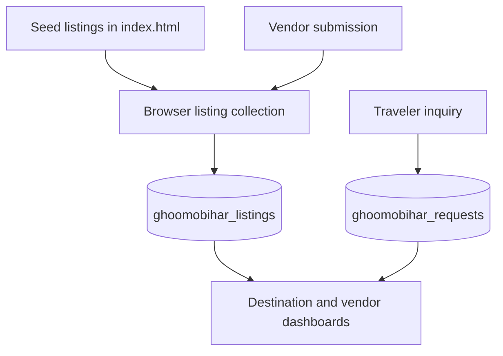

# Data architecture and ownership

This document describes what the GhoomoBihar hackathon prototype stores, where it is stored and which claims are safe to make during judging. It distinguishes the implemented prototype from the production architecture proposed in [FUTURE-SCOPE.md](FUTURE-SCOPE.md).

## Current storage map

| Data | Implemented storage | Shared across devices? | Persistence and trust boundary |
| --- | --- | --- | --- |
| Seed destination listings | `DEFAULT_LISTINGS` in `index.html` | Yes, as repository content | Reloaded from the deployed application source |
| Vendor-submitted listings and moderation changes | Browser `localStorage`: `ghoomobihar_listings` | No | Remains only in that browser until site data is cleared |
| Booking inquiries | Browser `localStorage`: `ghoomobihar_requests` | No | Remains only in that browser until site data is cleared |
| Optional traveler profile | Browser `localStorage`: `ghoomobihar_traveler_profile` | No | Convenience data; not an authenticated traveler identity |
| Current vendor display cache | Browser `localStorage`: `ghoomobihar_current_vendor` | No | UI cache only; Supabase remains the authentication authority |
| Vendor identity and session | Supabase Auth | Yes | Centralized authentication managed by Supabase |
| Tourism feedback | Supabase Postgres: `public.tourism_feedback` | Yes | Validated by database constraints and protected by Row Level Security |
| Public district-demand signals | Supabase RPC: `get_tourism_feedback_signals()` | Yes | Returns aggregate totals only, not individual feedback records |
| Admin authentication | Netlify Function + signed HttpOnly cookie | Session only | Credentials are checked server-side; secrets never enter browser storage |
| AI credentials | Netlify environment variables | Server only | `GROQ_API_KEY` is never delivered to the browser |

## Listing lifecycle in the prototype

1. The application starts with `DEFAULT_LISTINGS` from `index.html`.
2. On first load, the browser copies those records into the in-memory `listings` collection.
3. A vendor submission is appended to that collection and serialized into `ghoomobihar_listings`.
4. Moderation status changes update the same browser-local collection.
5. Booking inquiries are serialized separately into `ghoomobihar_requests`.
6. The vendor and admin dashboards render from those browser-local records.

This makes the full interaction loop demonstrable without a database migration. It does **not** provide a centralized marketplace database. A listing submitted in one browser does not appear automatically on another device, and clearing site data removes browser-local records.

## How to demonstrate the records

In Chrome:

1. Open GhoomoBihar and submit a test vendor listing.
2. Open **Developer Tools → Application → Local Storage**.
3. Select the current GhoomoBihar origin.
4. Inspect `ghoomobihar_listings` for listing JSON.
5. Submit a test booking inquiry and inspect `ghoomobihar_requests`.

Use demonstration data only. Do not enter real personal information because these prototype records are not backed by production retention, access-control or deletion workflows.

## Supabase boundary

Supabase is currently used for:

- vendor registration, email verification and authentication;
- the `tourism_feedback` table;
- privacy-safe aggregate district-demand signals.

Supabase is **not currently** the persistence layer for vendor listings, listing moderation or booking inquiries. The repository contains no production `listings` or `booking_inquiries` table migration.

## AI execution modes

Shartak has two response paths:

| Mode | Trigger | User-visible status | Behavior |
| --- | --- | --- | --- |
| Live AI | Netlify Function and upstream Groq request succeed | `Live AI Guide` | Uses the server-side tourism prompt and Groq response |
| Local fallback | Function is missing, times out or returns no usable reply | `Local AI Guide` | Uses the browser's curated Bihar knowledge engine |

The guided Bihar Yatra planner is a deterministic in-browser workflow and does not require a successful Groq request. It uses the selected duration, budget, interest and starting point to construct a day-wise itinerary from the application's curated destinations and listings.

## Safe judging statement

> For the hackathon prototype, seed and vendor-submitted listings plus booking inquiries are persisted as structured JSON in browser localStorage. Vendor authentication and tourism feedback are centralized in Supabase, while admin credentials and AI secrets remain server-side in Netlify. The production roadmap migrates listings and inquiries to Supabase Postgres with ownership policies, audit history and controlled moderation.

## Claims to avoid

Do not claim that:

- vendor listings are already stored in a central Supabase table;
- localStorage records are synchronized across devices;
- a verification badge is a government certification;
- a booking inquiry is a confirmed or paid reservation;
- Direct-to-Local Impact is audited income;
- every Shartak response comes from live Groq AI.
