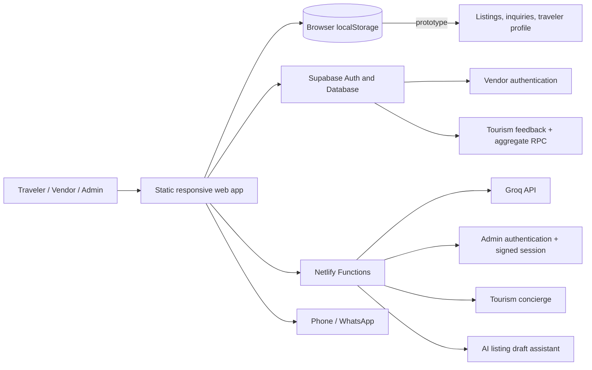

# GhoomoBihar

**A trusted, AI-assisted tourism marketplace connecting Bihar's visitors with local guides, homestays, food makers and heritage artisans.**

[Live demo](https://ghoomobihar.netlify.app/) · [Repository](https://github.com/Tejas-India-Hackathon-2026/Team-EDGEFORGE-AI) · Team EDGEFORGE-AI · Tejas India Hackathon 2026

> GhoomoBihar is a working hackathon prototype. It demonstrates the complete visitor-to-local-provider journey across five Bihar destination clusters while documenting the security and data work still required before production use.

## Contents

- [Problem](#problem)
- [Solution](#solution)
- [What the prototype demonstrates](#what-the-prototype-demonstrates)
- [Destination coverage](#destination-coverage)
- [Architecture](#architecture)
- [Data persistence and ownership](#data-persistence-and-ownership)
- [Technology stack](#technology-stack)
- [User journeys](#user-journeys)
- [Authentication and security](#authentication-and-security)
- [Supabase data model](#supabase-data-model)
- [AI services](#ai-services)
- [Project structure](#project-structure)
- [Local setup](#local-setup)
- [Netlify deployment](#netlify-deployment)
- [Testing](#testing)
- [Known limitations](#known-limitations)
- [Roadmap](#roadmap)
- [Future scope](FUTURE-SCOPE.md)
- [Judge and presentation guide](#judge-and-presentation-guide)
- [Troubleshooting](#troubleshooting)

## Problem

Bihar has globally significant heritage, pilgrimage, nature, food and craft experiences, but discovery and local economic participation remain fragmented.

- Visitors often need several unrelated sites or informal contacts to plan one trip.
- Small providers can be difficult to discover online and may depend on intermediaries.
- Travelers need clearer trust signals, direct contact, practical guidance and safety information.
- District expansion without verification can increase misinformation and visitor risk.
- Local feedback is rarely converted into a measurable tourism-improvement roadmap.

## Solution

GhoomoBihar brings destination discovery, verified-style listing presentation, vendor onboarding, direct inquiries, tourism feedback and AI guidance into one responsive experience.

The prototype is designed around three principles:

1. **Discover deeply:** destination pages combine guides, stays, food and crafts with topic-specific imagery.
2. **Connect directly:** travelers can call or message local providers without a platform payment step or hidden markup.
3. **Scale responsibly:** new districts enter through verification, safety, source-review and moderation gates.

## What the prototype demonstrates

### Traveler experience

- Five destination clusters with category filters.
- Distinct, context-relevant images for individual heritage, food, stay and craft listings.
- Listing cards with price, hours, contact actions and trust indicators.
- Direct phone and WhatsApp connections to providers.
- Booking/inquiry form without requiring a traveler account.
- Optional local traveler profile for faster repeat inquiries.
- AI tourism concierge with a local knowledge fallback when the serverless endpoint is unavailable.
- Guided Bihar Yatra planner with one-tap duration, daily budget, interest and origin choices.
- Direct-to-Local Impact proof on plans and booking confirmations, explicitly labelled as estimated demo metrics.
- Tourism feedback form with district-demand signals.
- QR standee experience for event or destination discovery.

### Vendor experience

- Supabase email/password registration and sign-in.
- Email verification before access.
- Lightweight CAPTCHA check in the interface.
- AI listing assistant that converts a short brief into a structured draft.
- Listing submission and personal listing/inquiry dashboards.
- Moderation status before an approved listing appears as active.

### Administrator experience

- User ID/password verification inside a Netlify Function.
- Signed four-hour `HttpOnly`, `Secure`, `SameSite=Strict` session cookie.
- Pending-listing review, active-listing management and inquiry views.
- No admin user ID, password or signing secret in the repository or browser storage.

## Destination coverage

The live pilot uses five destination clusters, representing five district footprints.

| Destination cluster | District footprint | Example experiences |
| --- | --- | --- |
| Jamui | Jamui | Gidhaur heritage, Simultala stay, Nagi-Nakti bird guide, Patneshwar craft, chhena sweets |
| Bodh Gaya | Gaya | Mahabodhi scholar walk, Sujata homestay, local cuisine, Bodhi-leaf art |
| Nalanda | Nalanda | Ancient university archaeology, Silao Khaja, Bawan Buti weaving |
| Sonepur Mela | Saran | Fair heritage walk, local stay, jalebi and chai, brass craft |
| Chhath Ghat | Patna | Ganga boat guidance, festival stay, thekua and anarsa, painted bamboo soop |

The listing photographs are intentionally mapped by subject. A food listing does not reuse a monument image, and a craft listing does not reuse a homestay image.

## Direct-to-Local Impact demo metric

The prototype does not claim measured income or completed transactions. Its impact card uses a transparent demonstration calculation:

```text
Estimated local livelihood impact = sum of one unit of each included listing's displayed indicative price
```

For one booking inquiry, the card uses the selected listing price. For a Shartak itinerary, it sums the displayed prices of the local listings included in that plan. The result represents potential direct local spend only; it is not confirmed payment, vendor profit or audited livelihood impact. Verification status comes from each listing's actual prototype `verified` and `status` fields. The platform processes no payment and charges no middleman commission in this prototype.

## Architecture



### Data flow

1. The browser loads `index.html` and its bundled CSS and JavaScript.
2. Destination and seed-listing data render directly in the browser.
3. Supabase JS manages vendor sessions and submits tourism feedback.
4. AI requests go only to same-origin Netlify Functions; the browser never receives `GROQ_API_KEY`.
5. The functions validate input, call Groq and return a constrained response.
6. Booking actions save a prototype inquiry locally and offer direct provider contact.
7. The public roadmap reads only privacy-safe aggregate feedback through a Supabase RPC.

## Data persistence and ownership

The prototype deliberately uses more than one storage boundary. The browser-local marketplace loop is demonstrable without pretending it is already a production database.

| Record | Current source of truth | Scope |
| --- | --- | --- |
| Seed listings | `DEFAULT_LISTINGS` in `index.html` | Deployed application source |
| Vendor listings and moderation changes | `localStorage.ghoomobihar_listings` | Current browser only |
| Booking inquiries | `localStorage.ghoomobihar_requests` | Current browser only |
| Vendor identity | Supabase Auth | Centralized |
| Tourism feedback | Supabase `tourism_feedback` | Centralized with RLS |
| Admin session | Netlify Function and signed HttpOnly cookie | Expiring server-verified session |

Clearing browser data removes browser-local listings and inquiries, and those records do not synchronize to another device. See [DATA-ARCHITECTURE.md](DATA-ARCHITECTURE.md) for the exact keys, lifecycle, demonstration steps and safe judging claims.

## Technology stack

| Layer | Technology | Purpose |
| --- | --- | --- |
| Frontend | HTML5, CSS3, vanilla JavaScript | Zero-build responsive application |
| Authentication | Supabase Auth + Netlify Function | Vendor sign-in + server-verified admin session |
| Database | Supabase Postgres | Tourism feedback and aggregate demand signals; listings remain browser-local in the prototype |
| Authorization | Signed HttpOnly cookie + Row Level Security | Admin session and feedback protection |
| Serverless backend | Netlify Functions, Node.js | Secret-preserving AI gateways |
| AI | Groq chat completions | Tourism concierge and structured listing drafts |
| Hosting | Netlify | Static hosting, functions and security headers |
| Direct connection | `tel:` and WhatsApp deep links | Traveler-to-provider communication |
| Testing | Node.js smoke test | Feedback/roadmap regression checks |

No frontend framework or bundler is required for the current prototype.

## User journeys

### Traveler workflow

1. Open the live site or scan its QR code.
2. Choose a destination cluster.
3. Filter by guide, homestay, food or craft.
4. Inspect the provider card, price, opening hours and contact path.
5. Call, open WhatsApp or submit a booking inquiry.
6. Ask the AI concierge for route, food or cultural guidance.
7. Submit feedback and request the next district.

### Vendor workflow

1. Select **Login / Join** and open the vendor tab.
2. Register with name, email, password and optional phone number.
3. Verify the email, then sign in.
4. Describe the service to the AI assistant or complete the form manually.
5. Review every generated field before submitting.
6. Track submitted listings and locally recorded inquiries in the same browser's dashboard.

The AI assistant does not invent official verification, contact details, addresses, prices or opening hours that are absent from the vendor brief.

### Admin workflow

1. Generate the admin credential hashes and signing secret locally.
2. Store only those generated values in Netlify environment variables and redeploy.
3. Open **Login / Join → Admin Mode**.
4. Enter the private user ID and password.
5. Review pending listings, active listings and inquiries.

See [ADMIN-SECURITY-SETUP.md](ADMIN-SECURITY-SETUP.md) for the one-time configuration.

## Authentication and security

### Implemented controls

- Admin credentials are not stored in HTML, JavaScript, documentation or Git history.
- Vendor authentication uses Supabase email/password sessions and email confirmation.
- Admin credentials are verified by a Netlify Function using SHA-256 for user ID lookup and salted scrypt for the password.
- Admin state uses a signed, expiring `HttpOnly`, `Secure`, `SameSite=Strict` cookie—not `localStorage`.
- Admin login POST requests are restricted to configured trusted origins.
- `GROQ_API_KEY` exists only in the serverless runtime.
- AI functions accept `POST`/`OPTIONS`, validate empty and oversized inputs, and enforce timeouts.
- AI listing output is parsed, allow-listed and length-limited before reaching the form.
- Feedback fields have browser checks, SQL constraints and Row Level Security.
- Public feedback analytics expose totals only—not names, comments or individual records.
- Dynamic text is sanitized before being inserted into rendered interfaces.
- Netlify sets frame, MIME-sniffing and referrer security headers.
- Password inputs use the correct password input type and are cleared after admin attempts.

### Public values versus secrets

The Supabase project URL and publishable/anonymous client key are designed to be used in browser applications. Security must come from Auth, Row Level Security and restricted database privileges—not from trying to hide the publishable key.

Never expose any of the following:

- `GROQ_API_KEY`
- Supabase `service_role` key
- Admin passwords
- Admin user IDs, hashes and session signing secrets
- Personal access tokens
- Database passwords

Chrome Developer Tools can display every frontend asset and browser request. Therefore, no security decision in this project relies on hiding HTML or client-side JavaScript.

## Supabase data model

### Authentication

Supabase Auth stores vendor identities. Vendor display metadata uses `user_metadata`. Admin authentication is handled separately by the Netlify Function.

### `tourism_feedback`

Run [supabase/tourism-feedback.sql](supabase/tourism-feedback.sql) once in the Supabase SQL Editor. It creates:

- UUID and timestamp fields.
- District visited and next-district request.
- Rating constrained to 1–5.
- Controlled focus-area and recommendation values.
- Comments constrained to 20–600 characters.
- Public-consent and moderation-status fields.
- Indexes for creation time and requested district.
- Row Level Security policies.

Anonymous and authenticated visitors may insert only `pending` feedback. Only authenticated users with the admin role may read, update or delete individual feedback records.

The `get_tourism_feedback_signals()` RPC is a `security definer` aggregate that exposes only:

```text
total_feedback
top_requested_district
top_request_count
```

If the feedback table is not installed, the interface falls back to a browser-local demo store so the prototype remains demonstrable.

## AI services

Both AI endpoints are same-origin Netlify Functions and require `GROQ_API_KEY` in the server environment.

### Tourism concierge

`POST /.netlify/functions/chat`

```json
{
  "message": "What should I see in Jamui in one day?",
  "history": [
    { "sender": "user", "text": "I am travelling from Patna." }
  ]
}
```

Successful response:

```json
{
  "reply": "...",
  "model": "groq/compound",
  "mode": "live-groq-ai"
}
```

The server keeps the latest six history items, caps the generated response and uses a 12-second request timeout. If the function is unavailable, the interface uses its local Bihar knowledge engine.

The chat status is evidence of the active response path:

- **Live AI Guide:** the Netlify Function returned a usable upstream AI reply.
- **Local AI Guide:** the live request failed, timed out or returned no reply, so the curated browser knowledge engine answered instead.

The guided Bihar Yatra planner is an in-browser deterministic planner and remains demonstrable even when the upstream AI service is unavailable.

### Vendor listing assistant

`POST /.netlify/functions/listing-assistant`

```json
{
  "brief": "I run a two-hour bird walk near Nagi-Nakti from 6 AM for ₹500."
}
```

Successful response:

```json
{
  "success": true,
  "draft": {
    "title": "...",
    "category": "guide",
    "description": "...",
    "price": "₹500/tour",
    "specialty": "...",
    "openHours": "06:00-08:00"
  }
}
```

The server accepts briefs up to 1,000 characters, uses a strict JSON prompt, allow-lists categories and truncates every output field.

## Project structure

```text
.
├── index.html                         # Complete frontend application
├── assets/                            # Destination- and topic-specific images
├── netlify.toml                       # Hosting, functions and response headers
├── netlify/
│   └── functions/
│       ├── admin-auth.js              # Server-verified admin session gateway
│       ├── chat.js                    # Secure tourism concierge gateway
│       └── listing-assistant.js       # Secure listing-draft gateway
├── supabase/
│   └── tourism-feedback.sql           # Feedback schema, RLS and aggregate RPC
├── tests/
│   ├── admin-auth-smoke.test.js       # Authentication/session regression checks
│   └── feedback-roadmap-smoke.test.js # Feedback/roadmap regression checks
├── ADMIN-SECURITY-SETUP.md            # Admin setup and security boundary
├── DATA-ARCHITECTURE.md                # Exact prototype storage map and ownership
├── DISTRICT-EXPANSION-ROADMAP.md       # Responsible 38-district rollout plan
├── FUTURE-SCOPE.md                    # Prioritized production-hardening roadmap
├── JUDGE-DEMO-GUIDE.md                # Timed demo, judge Q&A and fallback paths
├── .env.example                       # Environment variable template
└── README.md                           # Project documentation
```

## Environment variables

Copy `.env.example` only for local Netlify development. Do not commit a real `.env` file.

| Variable | Required | Location | Purpose |
| --- | --- | --- | --- |
| `GROQ_API_KEY` | For live AI | Netlify environment or local `.env` | Authorizes server-to-server Groq requests |
| `ADMIN_USER_ID_HASH` | Yes | Netlify environment | SHA-256 hash of the private admin user ID |
| `ADMIN_PASSWORD_SALT` | Yes | Netlify environment | Random salt for scrypt password verification |
| `ADMIN_PASSWORD_HASH` | Yes | Netlify environment | Salted scrypt password hash |
| `ADMIN_SESSION_SECRET` | Yes | Netlify environment | Signs the expiring HttpOnly admin cookie |
| `ADMIN_ALLOWED_ORIGINS` | Recommended | Netlify environment | Comma-separated trusted site origins |

Do not prefix this variable with `PUBLIC_`, `VITE_` or `NEXT_PUBLIC_`; doing so could expose it to a frontend build.

## Local setup

### Fast static preview

Requirements: Git and Python 3.

```bash
git clone https://github.com/Tejas-India-Hackathon-2026/Team-EDGEFORGE-AI.git
cd Team-EDGEFORGE-AI
python -m http.server 8080
```

Open `http://localhost:8080`.

This mode is enough to inspect the interface and local fallback behavior. Netlify Functions are not provided by Python's static server, so live Groq calls will fall back gracefully.

### Full local Netlify runtime

Requirements: Node.js and the Netlify CLI.

1. Create a local `.env` from `.env.example` and add a valid Groq key.
2. From the repository root, run:

```bash
netlify dev
```

3. Open the local URL printed by the CLI, normally `http://localhost:8888`.

There is no `npm install` or `npm run dev` step because this repository is a zero-build static application and does not contain a `package.json`.

## Netlify deployment

1. Import the GitHub repository into Netlify.
2. Keep the repository root as the base directory.
3. No build command is required.
4. The publish directory is `.` and functions directory is `netlify/functions` via `netlify.toml`.
5. Add `GROQ_API_KEY` and the five admin authentication variables under **Site configuration → Environment variables**.
6. Deploy the current `main` branch.

After deployment, verify:

- The landing page and all five destination clusters load.
- Every listing image is relevant and distinct where intended.
- The AI concierge returns a live answer.
- The listing assistant produces a structured draft.
- Vendor registration sends a confirmation email.
- Invalid admin credentials cannot open the admin panel.
- Feedback submits to Supabase or clearly reports its local fallback.

## Testing

Run the repository smoke test with Node.js:

```bash
node tests/feedback-roadmap-smoke.test.js
node tests/admin-auth-smoke.test.js
```

The test checks the expansion roadmap, form controls, Supabase insert path, aggregate RPC, local fallback, Row Level Security SQL and removal of the old hardcoded-admin pattern.

Recommended manual checks:

- Responsive layout at mobile and desktop widths.
- Category filtering for every destination.
- Missing-function fallback under a static local server.
- Vendor sign-up, email verification and sign-in.
- Admin rejection for invalid credentials, foreign origins and tampered cookies.
- AI rejection of empty or oversized input.
- No secret values in page source, browser network responses or Git history.

## Known limitations

This is a hackathon prototype, not a production booking platform.

- Listings, moderation changes and booking inquiries are currently saved in each browser's `localStorage`; they are not shared across devices.
- Provider verification badges are prototype presentation data, not a government certification claim.
- Booking is an inquiry and direct-contact workflow; the platform does not process payments.
- Direct-to-Local Impact amounts are estimated demo metrics derived from indicative listing prices, not real transaction or income data.
- A client-side arithmetic CAPTCHA is friction against simple automated attempts, not a replacement for server-side bot protection or rate limiting.
- AI output can be incomplete or incorrect and must be verified against official sources.
- The two AI functions currently return permissive CORS headers; production deployment should restrict origins where appropriate.
- Production launch requires database-backed listings/inquiries, complete RLS policies, audit logs, rate limiting, monitoring, backups and a formal incident process.

## Roadmap

### Phase 1 — Live pilot

Validate the loop across Jamui, Gaya, Nalanda, Saran and Patna:

```text
QR discovery → destination guidance → local connection → inquiry → feedback → moderation
```

### Phase 2 — Heritage circuit expansion

Proposed next districts: Rohtas, Kaimur, Vaishali and East Champaran.

Each district must meet entry gates for verified providers, official-source review, safety contacts, transport guidance, local moderation ownership and pilot metrics.

### Phase 3 — Statewide network

Extend the reusable district model to all 38 Bihar districts with multilingual guidance, standardized verification, shared database records, safety escalation and district analytics.

See [DISTRICT-EXPANSION-ROADMAP.md](DISTRICT-EXPANSION-ROADMAP.md) for geographic expansion gates and [FUTURE-SCOPE.md](FUTURE-SCOPE.md) for the prioritized production architecture, security, verification, reliability and measurement roadmap.

## Judge and presentation guide

The presentation-day deployment snapshot, five-minute demo script, safe claims, likely judge questions and failure-safe demo paths are maintained in [JUDGE-DEMO-GUIDE.md](JUDGE-DEMO-GUIDE.md).

## Troubleshooting

### `npm` cannot find `package.json`

This repository does not use an npm build. Run a static server or `netlify dev`; do not run `npm install`, `npm run dev` or `npx vite`.

### `localhost refused to connect`

No server is running on that port. Start `python -m http.server 8080` and open port 8080, or start `netlify dev` and use the exact URL it prints.

### AI shows its fallback response

- Confirm the site is running through Netlify rather than a basic static server.
- Confirm `GROQ_API_KEY` exists in the Netlify environment.
- Redeploy after changing environment variables.
- Inspect the function logs for timeout, quota or upstream API errors.

### Admin credentials work but access is denied

- Confirm all five admin environment variables exist in the Netlify site.
- Confirm `ADMIN_ALLOWED_ORIGINS` exactly matches the live site origin without a trailing slash.
- Redeploy after changing environment variables, then log out and sign in again.

### Feedback remains local

Run `supabase/tourism-feedback.sql` in the same Supabase project used by the frontend, then confirm the table and RPC exist and their RLS policies are enabled.

## Responsible development

- Use feature branches and descriptive commits that correspond to real work.
- Do not inflate commit counts with empty or cosmetic history.
- Never commit secrets, credentials or real traveler personal data.
- Check destination facts against primary government or institutional sources.
- Review AI-generated content before publishing it.
- Keep image subjects aligned with the service being represented.

## Reference sources

- [Bihar Tourism destinations](https://tourism.bihar.gov.in/en/destinations)
- [Bihar Tourism district directory](https://tourism.bihar.gov.in/en/districts)
- [Bihar State Data Lab](https://statedata.bihar.gov.in/)
- [Supabase documentation](https://supabase.com/docs)
- [Netlify Functions documentation](https://docs.netlify.com/build/functions/overview/)

## Team

Built by **Team EDGEFORGE-AI** for the **Tejas India Hackathon 2026**.

The repository currently does not declare an open-source license. All rights remain with the project owners unless a license is added.
